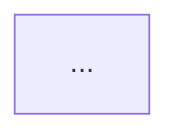

# Draw the graph

```bash
fluxlint graph clusters/production > graph.dot          # Graphviz
fluxlint graph --format mermaid clusters/production     # Mermaid
```

The graph has one node for each Kustomization and HelmRelease.

| Drawn as | Meaning |
| --- | --- |
| solid edge | `dependsOn` |
| dotted edge | a parent Kustomization creates the child |
| dashed edge, labelled | a need fluxlint found: a namespace, a CRD, a source, a Secret |
| bold | the critical path |
| red | part of a deadlock |

A dashed edge with no solid edge beside it is a need that nothing orders. fluxlint
reports the same thing as `FL-T006`.

Render the Graphviz output with `dot`:

```bash
fluxlint graph clusters/production | dot -Tsvg > graph.svg
```

Mermaid output can go straight into a merge request description or a Markdown file:

````markdown

````
